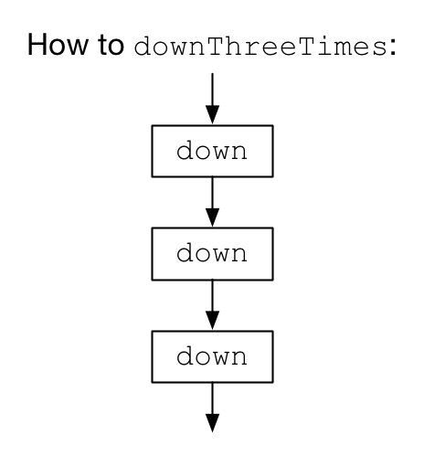
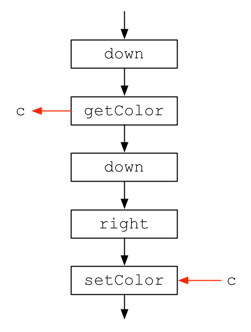
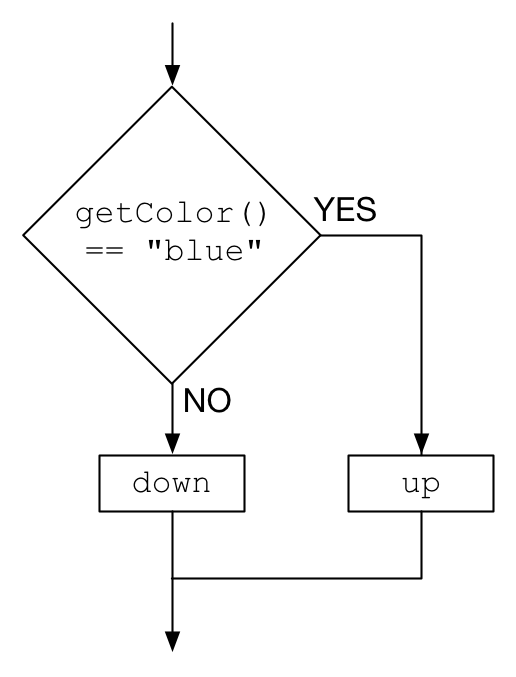
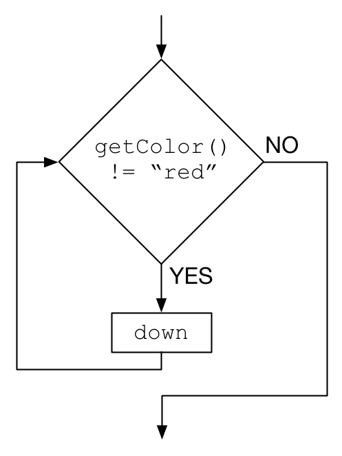
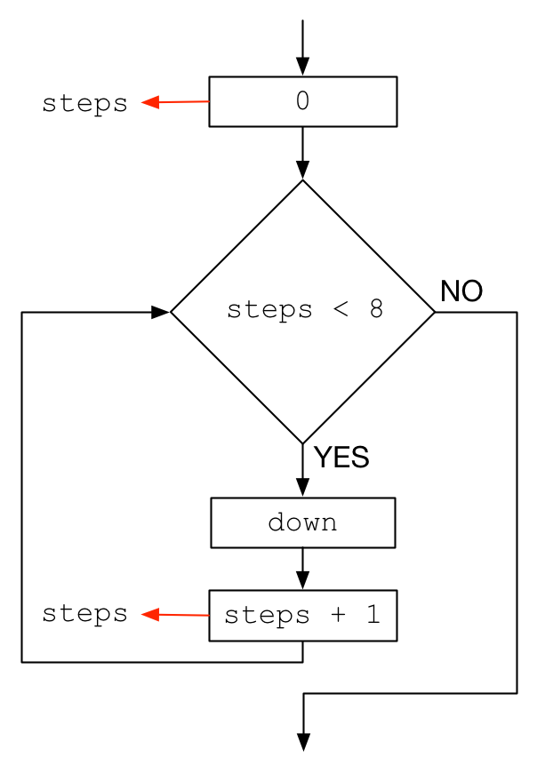

# CCA Programming & Electronics, Spring 2017

This course repository contains homework assignments, useful guides, and code for "Programming & Electronics" at CCA, Spring 2017.

Also included in this repository is the official [course syllabus](syllabus.pdf).

### Week 1: Wednesday, January 18, 2017

Lecture:
- Introductions
- What is programming?
- Goals & course details

Hands-on activities:
- Human Embodiment of Programmer & Robot
  - Programs generally run line-by-line.
  - While loops, if statements, and functions break that up.

#### Building Blocks of Code

In today's class, we explored the four building blocks of code: functions, variables (memory), `if` statements (conditions), and `while` loops.

**Functions**

A function is like a recipe. It describes what sequence of actions to take in order to get some desired result. Functions can be built-in, like `down`, `up`, `left`, and `right` in the Rudy the Red Dot puzzle game.

Getting the robot to run a recipe is pretty simple: in parentheses `()` after the function name, tell it what parameters to use. If ther are no parameter, leave the parentheses empty, but *don't omit the parentheses* or you'll just be referring to the recipe, not telling the computer to actually execute the recipe. For example:

- `down;` -- tells the computer "hey, remember the function we called `down`?"
- `down();` -- tells the computer "hey, remember the function we called `down`? **RUN IT**"

The simplest functions are sequences of single built-in functions. For example:

```
function downThreeTimes() {
  down();
  down();
  down();
}
```

The `downThreeTimes` function executes the `down` function three times; it's pretty basic. But remember, this is telling Rudy *how to run* the `downThreeTimes` recipe, it doesn't *tell Rudy to run the recipe*. To run it, you'd need to add `downThreeTimes();` to your code.

Here's the flowchart for the function `downThreeTimes`:



**Memory and Variables**

Memory is stored in the equivalent of a table. It might look something like this:

| name  | value  |
| ----- | ------ |
| color | "blue" |
| steps | 3      |

You can create new entries in the vable using the `var` keyword, like these two lines, which create the memory table above:

```
var color = "blue";
var steps = 3;
```

We didn't discuss `var` much in class, but you only need it the first time you use a variable. If you read it or update it later, you can't have `var` again.

A super common use of variables is to store a value for later use. For example:

```
down();
var c = getColor();
down();
right();
setColor(c);
```

Or, equivalently, in flow-chart:



The red arrows indicate data going to or from memory, using the given variable name. The `getColor` function, for example, gives us back a "color" that we are storing in the variable named `c`. Then, later, the `setColor` function uses `c` as its color parameter.

Rememeber that setting a variable to the result of some function doesn't set up any kind of pemanent relationship: that function is run once, and the value you get back at that very moment is then saved in memory.

**`if` statements**

`if` statements let you control the flow of your code so that it doesn't just sequentially run every line of code you have. The typical `if` statement might look something like this:

```
if (getColor() == "blue") {
  up();
} else {
  down();
}
```

Equivalently, in flow-chart:



The `else` branch is optional. The curly-brace characters, `{}`, enclose all the lines of code that are part of the **YES** or **NO** branches of the `if`.

**`while` loops**

`while` loops are like `if` statements, but repeated. In other words, if the condition is true, not only is the body run, but the loop repeats itself and checks the condition again. A typical `while` loop might look something like this:

```
while (getColor() != "red") {
  down();
}
```

Equivalently, in flow-chart:



By combining a while loop with some memory, you can keep track of the number of times something has happened, and thus easily repeat a block of code a given number of times. For example:

```
var steps = 0;
while (steps < 8) {
  down();
  steps = steps + 1;
}
```

Equivalently, in flow-chart:



Whew. That's all we did today! If you're stuck on anything, ask a fellow student or email [me](mailto:jzamfirescupereira@cca.edu) or [Caroline](mailto:caroline.crandall@cca.edu) for help!

Here are some inspirational videos to get you excited for our class if you're not already:
- Basic robots
  - [Coffee-can robot](http://www.youtube.com/watch?v=b0mIshBIbvI#t=24)
  - [Tree-climbing robot](http://www.youtube.com/watch?v=zkpH1BjD6Wc)
  - [Self-balancing robot](http://www.youtube.com/watch?v=Tw9Jr-SPL0Y)
  - [Insect robot](http://www.youtube.com/watch?v=tOsNXg2vAd4#t=120)
  - [Treadbot](http://www.youtube.com/watch?v=YblSltHDbIU)
  - [Velociraptor robot](http://www.youtube.com/watch?v=lPEg83vF_Tw)
- Installations
  - [The Bay Lights](http://thebaylights.org/)
  - [Murmur Wall](http://www.future-cities-lab.net/projects/#/murmurwall/)
  - [Floating Couch](http://vimeo.com/72826106)
  - [Wooden Segment Mirror](https://www.youtube.com/watch?v=BZysu9QcceM#t=36)
  - [Generative design](https://www.youtube.com/watch?v=pNkz8wEJljc)
- Art & Music bots
  - [Textile weaving](https://vimeo.com/71044541)
  - [ReacTable](https://www.youtube.com/user/marcosalonso)
  - [Projection mapping](https://www.youtube.com/watch?v=czuhNcNU6qU)
  - [Laser harp](http://www.youtube.com/watch?v=sLVXmsbVwUs#t=20)
  - [Cubli: Floating Cube](https://www.youtube.com/watch?v=n_6p-1J551Y)
  - [Arc-o-matic](http://vimeo.com/57082262#at=130)
  - [Robo Faber](http://vimeo.com/78771257)
  - [Eggbot](https://www.youtube.com/watch?v=w4cdbV2oaEc)
- Drink-makers
  - [Textspresso](http://www.youtube.com/watch?v=kx9D74t7GD8#t=89)
  - [The Inebriator](http://www.youtube.com/watch?v=WqY7fchs7H0)
- Computer Numerical Control (CNC)
  - [Shapoko / tinyg](http://www.youtube.com/watch?v=pCC1GXnYfFI#t=11)
  - [Makerbot Replicator](http://www.youtube.com/watch?v=NAbiAzYhTOQ)
- Vacuuming
  - [Roomba](https://www.youtube.com/watch?v=0DNkbZvVYvc)

[Homework for Week 1](hw/week1.md)

### Week 2: Wednesday, January 25, 2017

First, homework reivew. Then, a workshop.

#### Workshop

Together, we'll experiment with a few sketches to practice variables:

- [A Single Ellipse](http://p5js.zamfi.net/jd/sketches/SkPx0nSPx)
  - Working with a partner, modify this sketch to create an ellipse that extends past the edges of the canvas.
- [Random Dots](http://p5js.zamfi.net/full/HJ6LyTBPx)
  - Working with a partner, modify this sketch to give each ellipse:
     1. A random size.
     2. A random color. (Use HSB for nicer colors!)
- [Color and HSB](http://p5js.zamfi.net/full/ByanCnHPx)
  - Working with a partner, modify this sketch so that it continuously changes color instead of stopping at red.
- [Nice Little House](http://p5js.zamfi.net/full/HJRrZprPe)
  - Working with a partner, modify your house so that it is drawn at the location of your mouse, as you move the mouse. Use the `mouseX` and `mouseY` variables available to you in p5.js.

Then we'll practice loops:

- [Vertical Stripes](http://p5js.zamfi.net/jd/full/Bk4ZHpBDx)

Use what we discussed to reproduce this sketch:


Here's one way of working with loops, and figuring out how to turn a pattern into code:

1. Write down the coordinates of the shapes you want to create in your loop.
2. Find the pattern for those coordinates
  a. Where does it start?
  b. Where does it end?
  c. How much does it change each time?
3. Use that pattern in a for loop: `for (var i = START; i < END; i = i + CHANGE) { ... }`
  
For example, to create the following sketch:


...start by writing down some endpoints for those lines:

```
(20, 20) -> (20, 20)
(20, 30) -> (30, 20)
(20, 40) -> (40, 20)
(20, 50) -> (50, 20)
(20, 60) -> (60, 20)
(20, 70) -> (70, 20)
(20, 80) -> (80, 20)
.
.
.
(20, 480) -> (480, 20)
```

...from these coordinates, we can find a pattern for each of the four parameters we need to draw a line:

- `startX`: always 20
- `startY`: starts at 20, ends at 480, goes up by 10 each time
- `endX`: starts at 20, ends at 480, goes up by 10 each time
- `endY`: always 20

...from this pattern, we can generate a loop that draws these lines, by creating a variable that starts at `20`, ends at `480`, and goes up by `10` each time. We won't call the variable `x` or `y` beacuse we don't use it exclusively for either coordinate.

```javascript
for (var i = 20; i <= 480; i = i + 10) {
  var startX = 20;
  var startY = i;
  var endX = i;
  var endY = 20;
  line(startX, startY, endX, endY);
}
```

You'll explore a few more similar puzzles in the homework!

[Homework for Week 2](hw/week2.md)

