# CCA Programming & Electronics, Spring 2017

This course repository contains homework assignments, useful guides, and code for "Programming & Electronics" at CCA, Spring 2017.

Also included in this repository is the official [course syllabus](syllabus.pdf).

### Week 1: Wednesday, January 18, 2017

Lecture:
- Introductions
- What is programming?
- Goals & course details

Hands-on activities:
- Human Embodiment of Programmer & Robot
  - Programs generally run line-by-line.
  - While loops, if statements, and functions break that up.

#### Building Blocks of Code

In class, we discussed the four basic building blocks of code: functions, variables, conditions, and loops. 

[Here are some notes.](building-blocks.md)

#### Inspiration

Finally, here are some inspirational videos to get you excited for our class if you're not already:
- Basic robots
  - [Coffee-can robot](http://www.youtube.com/watch?v=b0mIshBIbvI#t=24)
  - [Tree-climbing robot](http://www.youtube.com/watch?v=zkpH1BjD6Wc)
  - [Self-balancing robot](http://www.youtube.com/watch?v=Tw9Jr-SPL0Y)
  - [Insect robot](http://www.youtube.com/watch?v=tOsNXg2vAd4#t=120)
  - [Treadbot](http://www.youtube.com/watch?v=YblSltHDbIU)
  - [Velociraptor robot](http://www.youtube.com/watch?v=lPEg83vF_Tw)
- Installations
  - [The Bay Lights](http://thebaylights.org/)
  - [Murmur Wall](http://www.future-cities-lab.net/projects/#/murmurwall/)
  - [Floating Couch](http://vimeo.com/72826106)
  - [Wooden Segment Mirror](https://www.youtube.com/watch?v=BZysu9QcceM#t=36)
  - [Generative design](https://www.youtube.com/watch?v=pNkz8wEJljc)
- Art & Music bots
  - [Textile weaving](https://vimeo.com/71044541)
  - [ReacTable](https://www.youtube.com/user/marcosalonso)
  - [Projection mapping](https://www.youtube.com/watch?v=czuhNcNU6qU)
  - [Laser harp](http://www.youtube.com/watch?v=sLVXmsbVwUs#t=20)
  - [Cubli: Floating Cube](https://www.youtube.com/watch?v=n_6p-1J551Y)
  - [Arc-o-matic](http://vimeo.com/57082262#at=130)
  - [Robo Faber](http://vimeo.com/78771257)
  - [Eggbot](https://www.youtube.com/watch?v=w4cdbV2oaEc)
- Drink-makers
  - [Textspresso](http://www.youtube.com/watch?v=kx9D74t7GD8#t=89)
  - [The Inebriator](http://www.youtube.com/watch?v=WqY7fchs7H0)
- Computer Numerical Control (CNC)
  - [Shapoko / tinyg](http://www.youtube.com/watch?v=pCC1GXnYfFI#t=11)
  - [Makerbot Replicator](http://www.youtube.com/watch?v=NAbiAzYhTOQ)
- Vacuuming
  - [Roomba](https://www.youtube.com/watch?v=0DNkbZvVYvc)

[Homework for Week 1](hw/week1.md)

### Week 2: Wednesday, January 25, 2017

First, homework reivew. Then, a workshop.

#### Workshop

Together, we'll experiment with a few sketches to practice variables:

- [A Single Ellipse](http://p5js.zamfi.net/jd/sketches/SkPx0nSPx)
  - Working with a partner, modify this sketch to create an ellipse that extends past the edges of the canvas.
- [Random Dots](http://p5js.zamfi.net/full/HJ6LyTBPx)
  - Working with a partner, modify this sketch to give each ellipse:
     1. A random size.
     2. A random color. (Use HSB for nicer colors!)
  - **Here's the code we came up with in class: [random-dots.js](class-code/random-dots.js)**
- [Color and HSB](http://p5js.zamfi.net/full/ByanCnHPx)
  - Working with a partner, modify this sketch so that it continuously changes color instead of stopping at red.
  - **Here's the code we came up with in class: [cycling-hue.js](class-code/cycling-hue.js)**
- [Nice Little House](http://p5js.zamfi.net/full/HJRrZprPe)
  - Working with a partner, modify your house so that it is drawn at the location of your mouse, as you move the mouse. Use the `mouseX` and `mouseY` variables available to you in p5.js.
  - **Here's one possible set of code, based in part on ideas we discussed in class: [moving-house.js](class-code/moving-house.js)**

Make sure you understand the principles behind [random-dots.js](class-code/random-dots.js) and [cycling-hue.js](class-code/cycling-hue.js), two of the sketches we worked on in class, before you move on to the homework! Also take a look at [moving-house.js](class-code/moving-house.js), one approach to moving the house with the mouse -- it could be useful inspiration for your homework.

[Homework for Week 2](hw/week2.md)

### Week 3: Wednesday, February 1, 2017

Today, we'll practice loops:

1.  Together, we'll make vertical lines:
    
    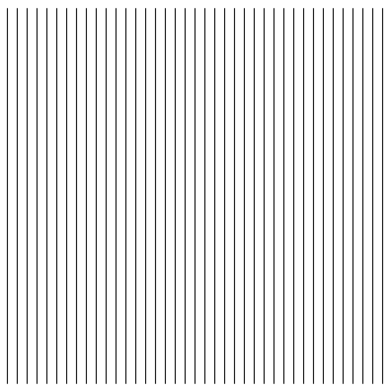

2.  Then, with a partner, you'll make horizontal lines:
    
    

3.  Try an animation with your partner too:
    
    

4.  Try this animation too:
    
    

5.  Now try this grid of circles; you'll need **nested loops** for this one!
    
    

6.  **Challenge:** Using a technique called the "exponential moving average", we can create a smooth easing animation like this:
    
    
    
    The technique works by one variable to store intermediate values for another variable. For example, in the sketch above, the *x-* and *y-* coordinates of the circle are stored in variables `x` and `y`, which are **eased** to the target values given by `mouseX` and `mouseY`.
    
    "Exponential moving average" is a fancy way of saying: first, pick a fixed **rate** at which the easing occurs for a variable reaching its target. That rate controls how much impact the target has on the value each frame. For exampe, if the rate is 10%, then the new value each frame is 10% the target value and 90% the old value of the variable. Here's some sample code; the key is in the line `x = target*rate + x*(1-rate);`:
    
    ```javascript
    function setup() {
      createCanvas(400, 400);
    }
    
    var rate = 0.1;
    var x = 0;
    var target = 100;
    
    function draw() {
      ellipse(x, 100, 15, 15);
      x = target*rate + x*(1-rate); // rate is 0.1, or 10% -- (1-rate) is 0.9, or 90%
    }
    ```
    
    Each frame, x gets 10% closer to its target.
    
    Modify this code to create a circle that follows the mouse as in the anigif above.


#### Working with Loops

Here's one way of working with loops, and figuring out how to turn a pattern into code:

1. Write down the coordinates of the shapes you want to create in your loop.
2. Find the pattern for those coordinates
  a. Where does it start?
  b. Where does it end?
  c. How much does it change each time?
3. Use that pattern in a for loop: `for (var i = START; i < END; i = i + CHANGE) { ... }`
  
For example, to create the following sketch:


...start by writing down some endpoints for those lines:

```
(20, 20) -> (20, 20)
(20, 30) -> (30, 20)
(20, 40) -> (40, 20)
(20, 50) -> (50, 20)
(20, 60) -> (60, 20)
(20, 70) -> (70, 20)
(20, 80) -> (80, 20)
.
.
.
(20, 480) -> (480, 20)
```

...from these coordinates, we can find a pattern for each of the four parameters we need to draw a line:

- `startX`: always 20
- `startY`: starts at 20, ends at 480, goes up by 10 each time
- `endX`: starts at 20, ends at 480, goes up by 10 each time
- `endY`: always 20

...from this pattern, we can generate a loop that draws these lines, by creating a variable that starts at `20`, ends at `480`, and goes up by `10` each time. We won't call the variable `x` or `y` beacuse we don't use it exclusively for either coordinate.

```javascript
for (var i = 20; i <= 480; i = i + 10) {
  var startX = 20;
  var startY = i;
  var endX = i;
  var endY = 20;
  line(startX, startY, endX, endY);
}
```

You'll explore a few more similar puzzles in the homework!

[Homework for Week 3](hw/week3.md)


### Week 4: Wednesday, February 8, 2017

Today, we'll review loops and get some more practice building them.

First, homework review. Working with a partner, go over your solutions to [homework 3](hw/week3.md).

Then, with a partner, try to recreate as many of the following sketches as you can:

1. Circles in a diagonal line. Use a while loop to draw the balls in sequence. What do you know about the *x* and *y* coordinates of each ball? (Spoiler: They're the same!)
   
   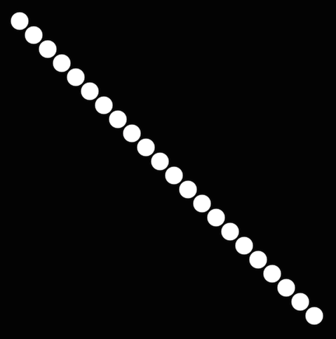

2. Circles in a grid. You will likely need a while loop inside another while loop!
   
   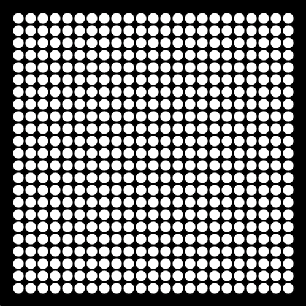

3. Colored circles in a grid, random version. Check out the `colorMode` function, and HSB, in the [P5.js reference](http://p5js.org/reference).
   
   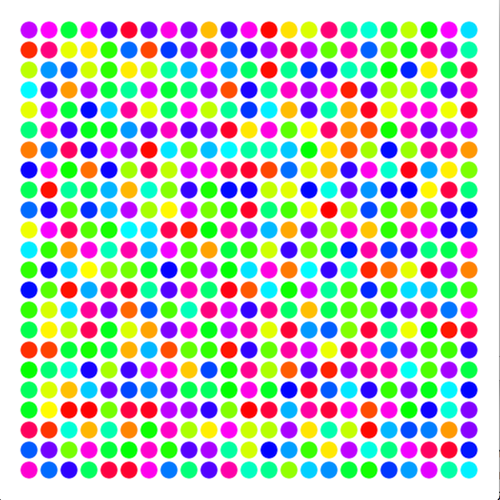

4. Colored circles in a grid, sequential version. Check out the `colorMode` function, and HSB, in the [P5.js reference](http://p5js.org/reference). Note that the colors shift from left to right *and* from top to bottom!

   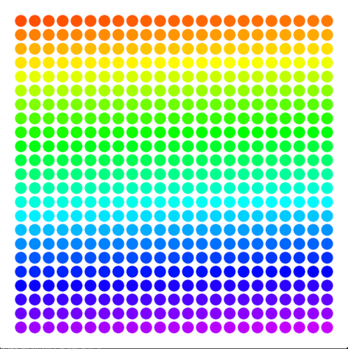

5. Circles in an triangle.

   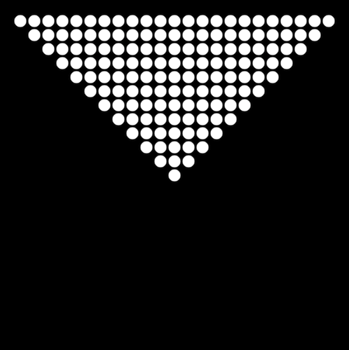
   
6. Circles in an hourglass.

   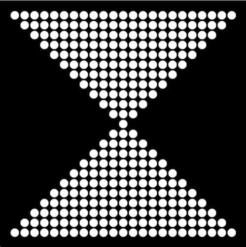

7. The grid.
   
   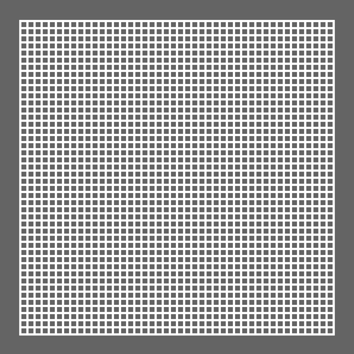
   
8. Diagonal lines.

   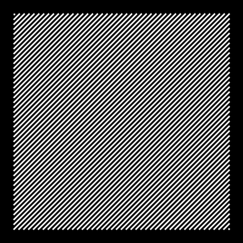

9. Diagonal lines, interrupted.

   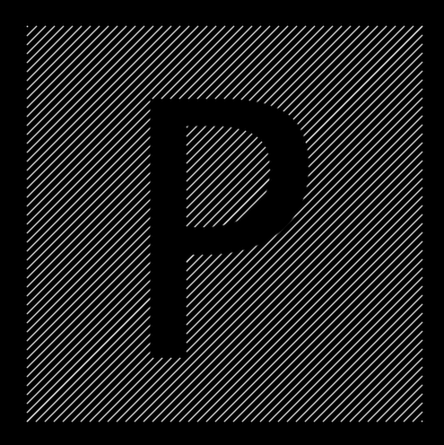

10. Random bars.

   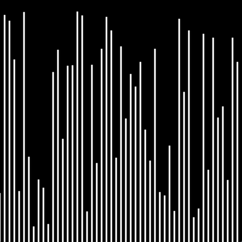

11. Random bars, animated.

   [](http://youtu.be/EA9MqlY56LM)

12. Animated bars, mouse-sensitive. You'll need the P5.js-defined variables `mouseX` and `mouseY` -- see the [P5.js reference](http://p5js.org/reference).

   [](http://youtu.be/3OAKqXS5Lkw)

13. Bouncing balls, just two.

   [](http://youtu.be/7sfC4-4VoM4)

14. **Optional Challenge:** Bouncing balls, more added by clicking. You may need to use an `Array` or two.

   [](http://youtu.be/Tnkhya3Tqu0)

15. **Optional Challenge:** Fireworks! They should track the mouse and appear on clicks.

   [](http://youtu.be/yNTUEe9cof8)
   
[Homework for Week 4](hw/week4.md)

### Week 5: Wednesday, February 15, 2017

Today we reviewed loops and together completed some in-class exercises.

[Homework for Week 5](hw/week5.md)