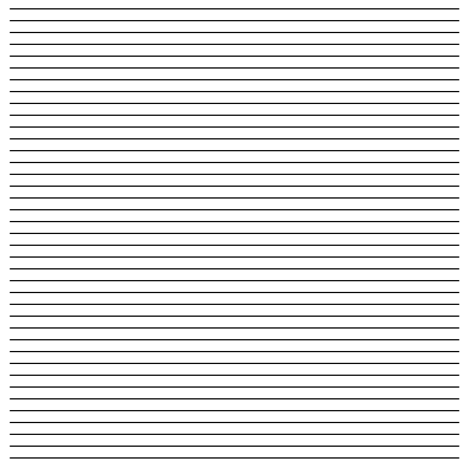

# CCA Programming & Electronics, Spring 2017

This course repository contains homework assignments, useful guides, and code for "Programming & Electronics" at CCA, Spring 2017.

Also included in this repository is the official [course syllabus](syllabus.pdf).

### Week 1: Wednesday, January 18, 2017

Lecture:
- Introductions
- What is programming?
- Goals & course details

Hands-on activities:
- Human Embodiment of Programmer & Robot
  - Programs generally run line-by-line.
  - While loops, if statements, and functions break that up.

#### Building Blocks of Code

In class, we discussed the four basic building blocks of code: functions, variables, conditions, and loops. 

[Here are some notes.](building-blocks.md)

#### Inspiration

Finally, here are some inspirational videos to get you excited for our class if you're not already:
- Basic robots
  - [Coffee-can robot](http://www.youtube.com/watch?v=b0mIshBIbvI#t=24)
  - [Tree-climbing robot](http://www.youtube.com/watch?v=zkpH1BjD6Wc)
  - [Self-balancing robot](http://www.youtube.com/watch?v=Tw9Jr-SPL0Y)
  - [Insect robot](http://www.youtube.com/watch?v=tOsNXg2vAd4#t=120)
  - [Treadbot](http://www.youtube.com/watch?v=YblSltHDbIU)
  - [Velociraptor robot](http://www.youtube.com/watch?v=lPEg83vF_Tw)
- Installations
  - [The Bay Lights](http://thebaylights.org/)
  - [Murmur Wall](http://www.future-cities-lab.net/projects/#/murmurwall/)
  - [Floating Couch](http://vimeo.com/72826106)
  - [Wooden Segment Mirror](https://www.youtube.com/watch?v=BZysu9QcceM#t=36)
  - [Generative design](https://www.youtube.com/watch?v=pNkz8wEJljc)
- Art & Music bots
  - [Textile weaving](https://vimeo.com/71044541)
  - [ReacTable](https://www.youtube.com/user/marcosalonso)
  - [Projection mapping](https://www.youtube.com/watch?v=czuhNcNU6qU)
  - [Laser harp](http://www.youtube.com/watch?v=sLVXmsbVwUs#t=20)
  - [Cubli: Floating Cube](https://www.youtube.com/watch?v=n_6p-1J551Y)
  - [Arc-o-matic](http://vimeo.com/57082262#at=130)
  - [Robo Faber](http://vimeo.com/78771257)
  - [Eggbot](https://www.youtube.com/watch?v=w4cdbV2oaEc)
- Drink-makers
  - [Textspresso](http://www.youtube.com/watch?v=kx9D74t7GD8#t=89)
  - [The Inebriator](http://www.youtube.com/watch?v=WqY7fchs7H0)
- Computer Numerical Control (CNC)
  - [Shapoko / tinyg](http://www.youtube.com/watch?v=pCC1GXnYfFI#t=11)
  - [Makerbot Replicator](http://www.youtube.com/watch?v=NAbiAzYhTOQ)
- Vacuuming
  - [Roomba](https://www.youtube.com/watch?v=0DNkbZvVYvc)

[Homework for Week 1](hw/week1.md)

### Week 2: Wednesday, January 25, 2017

First, homework reivew. Then, a workshop.

#### Workshop

Together, we'll experiment with a few sketches to practice variables:

- [A Single Ellipse](http://p5js.zamfi.net/jd/sketches/SkPx0nSPx)
  - Working with a partner, modify this sketch to create an ellipse that extends past the edges of the canvas.
- [Random Dots](http://p5js.zamfi.net/full/HJ6LyTBPx)
  - Working with a partner, modify this sketch to give each ellipse:
     1. A random size.
     2. A random color. (Use HSB for nicer colors!)
- [Color and HSB](http://p5js.zamfi.net/full/ByanCnHPx)
  - Working with a partner, modify this sketch so that it continuously changes color instead of stopping at red.
- [Nice Little House](http://p5js.zamfi.net/full/HJRrZprPe)
  - Working with a partner, modify your house so that it is drawn at the location of your mouse, as you move the mouse. Use the `mouseX` and `mouseY` variables available to you in p5.js.

Then we'll practice loops:

- [Vertical Stripes](http://p5js.zamfi.net/jd/full/Bk4ZHpBDx)

Use what we discussed to reproduce this sketch:



Here's one way of working with loops, and figuring out how to turn a pattern into code:

1. Write down the coordinates of the shapes you want to create in your loop.
2. Find the pattern for those coordinates
  a. Where does it start?
  b. Where does it end?
  c. How much does it change each time?
3. Use that pattern in a for loop: `for (var i = START; i < END; i = i + CHANGE) { ... }`
  
For example, to create the following sketch:


...start by writing down some endpoints for those lines:

```
(20, 20) -> (20, 20)
(20, 30) -> (30, 20)
(20, 40) -> (40, 20)
(20, 50) -> (50, 20)
(20, 60) -> (60, 20)
(20, 70) -> (70, 20)
(20, 80) -> (80, 20)
.
.
.
(20, 480) -> (480, 20)
```

...from these coordinates, we can find a pattern for each of the four parameters we need to draw a line:

- `startX`: always 20
- `startY`: starts at 20, ends at 480, goes up by 10 each time
- `endX`: starts at 20, ends at 480, goes up by 10 each time
- `endY`: always 20

...from this pattern, we can generate a loop that draws these lines, by creating a variable that starts at `20`, ends at `480`, and goes up by `10` each time. We won't call the variable `x` or `y` beacuse we don't use it exclusively for either coordinate.

```javascript
for (var i = 20; i <= 480; i = i + 10) {
  var startX = 20;
  var startY = i;
  var endX = i;
  var endY = 20;
  line(startX, startY, endX, endY);
}
```

You'll explore a few more similar puzzles in the homework!

[Homework for Week 2](hw/week2.md)

